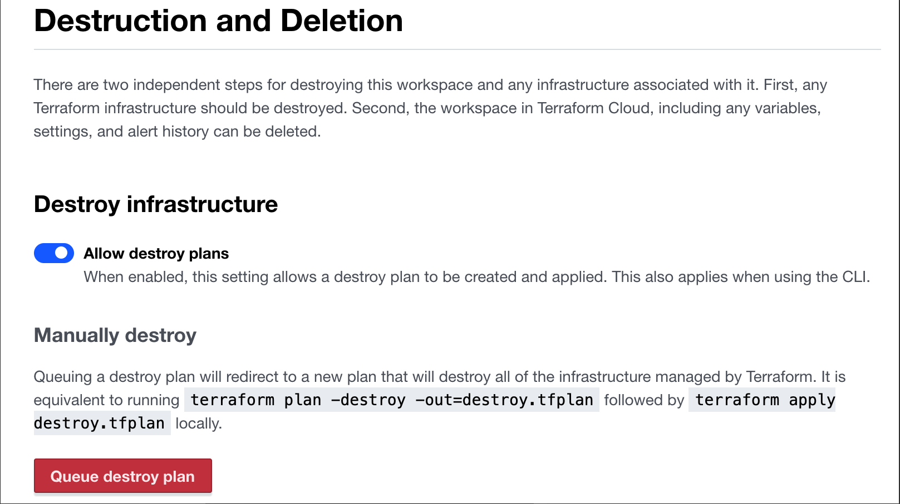
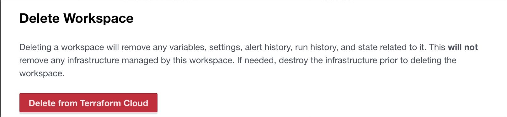
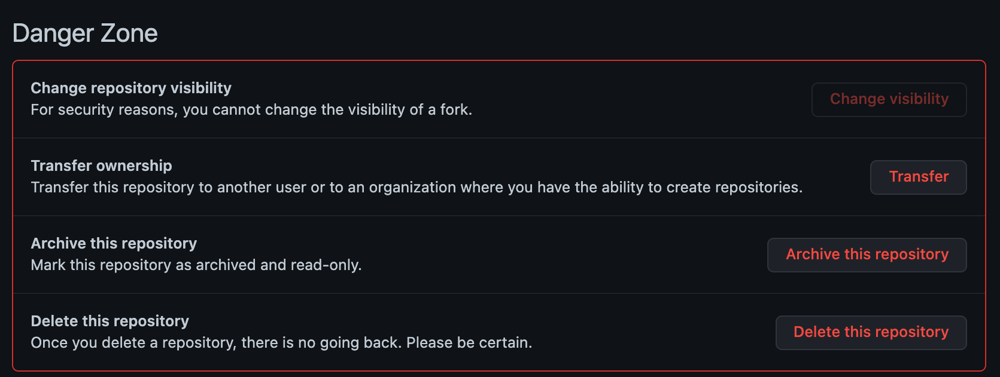
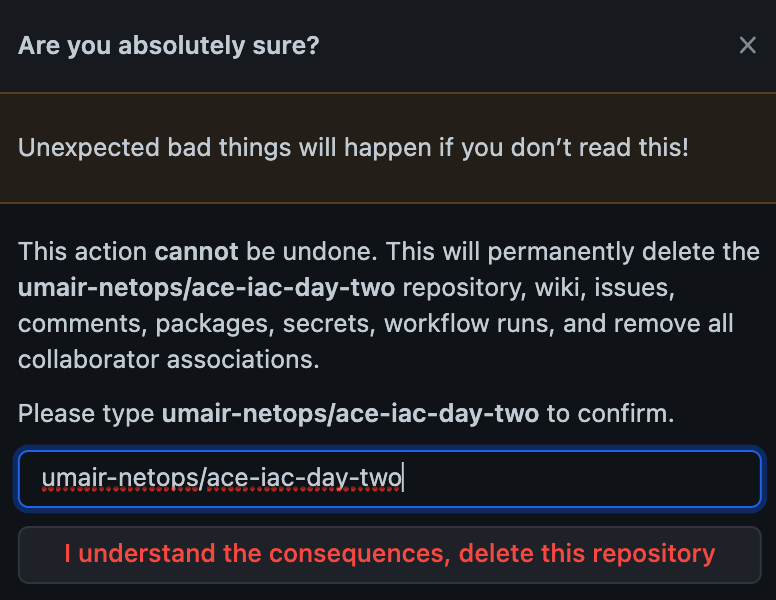
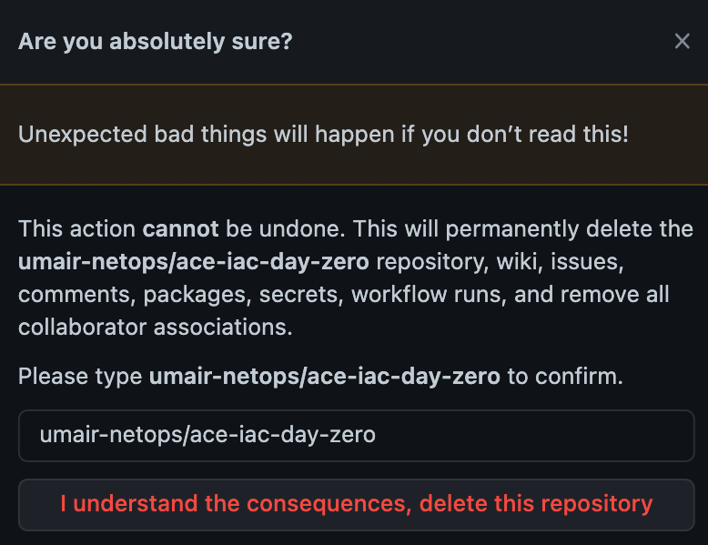

# Cleanup

Avoid excess charges by destroying your environment when done. The sequence is as follows:

## Destroy Lab 3 resources

Visit Terraform Cloud > ace-iac-day-two workspace > Settings menu > Destruction & Deletion > Queue Destroy Plan. Make sure you confirm the plan to proceed with the equivalent of a terraform destroy. This is sufficient for removing your resources created by Lab 3.

When it is complete, you can also delete the Workspace from Terraform Cloud.

This is all documented officially here.
Delete the remote repository for ace-iac-day-two in GitHub. Click on Settings and scroll all the way to the bottom to Danger Zone. Click  Delete this repository.

Type your repository name and click I understand the consequences, delete this repository.

## Destroy Lab 1 and Lab 2 resources

Recall that Lab 1 and Lab 2 share the same Terraform state in the same Terraform Cloud Workspace. The process of Lab 1 and Lab 2 cleanup is identical to the process for Lab 3.

Visit Terraform Cloud > ace-iac-day-zero workspace > Settings menu > Destruction & Deletion > Queue Destroy Plan. Make sure you confirm the plan to proceed with the equivalent of a terraform destroy. This is sufficient for removing your resources created by Lab 1 and Lab 2.

When it is complete, you can also delete the Workspace from Terraform Cloud. This is all documented officially here.
Delete the remote repository for ace-iac-day-zero in GitHub. Click on Settings and scroll all the way to the bottom to Danger Zone. Click Delete this repository.

## Destroy Controller and CoPilot from Sandbox Starter Tool

Destroy the Controller and CoPilot from the Sandbox Starter Tool UI by following the instructions here.

## Next Steps

You should now have a solid idea of how multicloud IaC components fit together. The next steps should be to follow this learning path at your pace:

Learn git basics. The tutorials on Atlassian are some of the best.
Learn more about GitHub from this tutorial.
Learn more about Terraform from the Hashicorp website
Visit some of the published Hashicorp workshops
Review the Aviatrix Terraform Provider documentation. Remember: Anything that can be configured on the Controller UI can be configured via Terraform as well.
