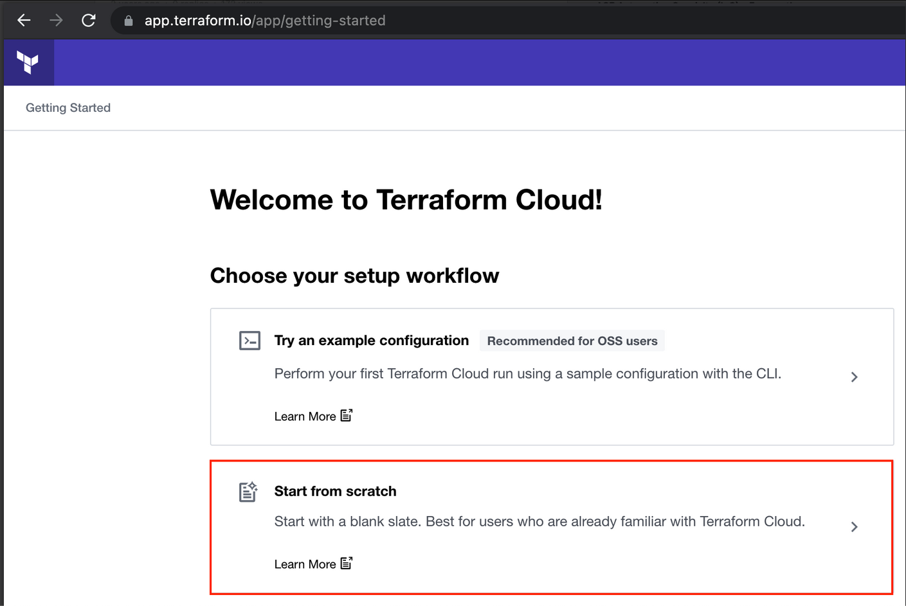
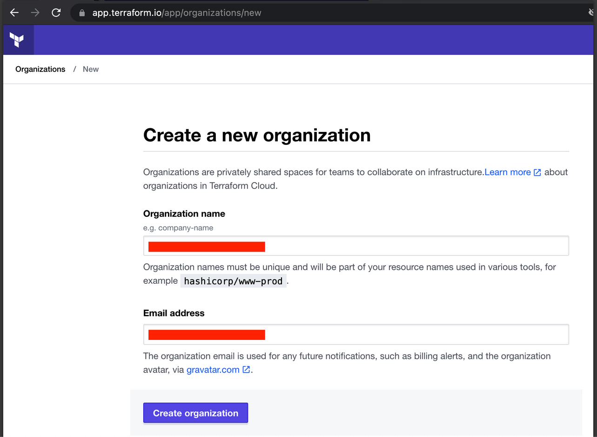

# Introduction

The ACE Automation Specialty Training (Infrastructure as Code - IaC) brings the concepts of DevOps together by automating secure cloud network infrastructure.

No coding experience is required.

There are 3 labs in this training, intended to be performed in sequence. Terraform is used for these labs. Many of Aviatrix's largest customers do not even leverage the Aviatrix UI to deploy or configure infrastructure. They perform every change in their using Terraform. At no point in this training will you be making any changes on the Aviatrix UI. This training is intended get you on the path of provisioning and automating your cloud network infrastructure with code.

## Prerequisites

- ACE Associate certification
- An active AWS account
- Aviatrix Controller and CoPilot instances deployed in AWS. The training materials expect you have deployed your Controller using the [Aviatrix Self-Service tool](https://selfservice.aviatrix.com).
- A GitHub account. [Sign up here](https://github.com/signup).
- A Terraform Cloud Organization account. [Sign up here](https://app.terraform.io/signup/account).
  
### Terraform cloud setup

First-time users of tfc should click `Start from scratch`.

On the next page, specify a new Organization name within Terraform Cloud and click Create Organization.

## Recommended Localizations

While you could perform the tasks for these labs directly on the GitHub UI, there are certain localizations on your PC that we recommend for working in a larger environment and/or Production. These include:

- [Terraform](https://developer.hashicorp.com/terraform/downloads): Even though you are executing your plans and applies in `Terraform Cloud`, there are several benefits to having `Terraform` installed locally on your workstation.
- [Git](https://git-scm.com/): The open source vcs (version control system) supported by `GitHub`.
- [Visual Studio Code](https://code.visualstudio.com/download): Code editor with embedded `git`.

For this training, all these localizations are optional. We will be using the web interface for `GitHub` and `Terraform` (i.e. Terraform Cloud).

## Focus

Gain familiarity with tools at your disposal for automating real-world cloud networks. Only a subset of Aviatrix use cases will be covered.

## Scenario

ACE Inc. is a fictitious company with infrastructure in AWS with 3 teams/stakeholders:

Network Operators, aka `NetOps`
Application Developers, aka `DevOps`
InfoSec team, aka `SecOps`

These labs will ask you to think in terms of these different personas as you perform different lab tasks.

In Lab 1, you will deploy ACE's infrastructure from scratch as follows:

The infrastructure is built in the AWS `us-west-2` region by default, although you can adjust the code to build it anywhere you want.

As shown in the diagram, inside the region, there are the following resources:

- A transit vpc with single `Aviatrix Transit Gateway`.
- A spoke vpc with single `Aviatrix Spoke Gateway` for a workload called `BU1 Bastion` in a `Network Domain` called `BU1`. This host has a public IP as well as a private IP. You can ssh to it as ubuntu. Be sure to set a strong password.
- A spoke vpc with single `Aviatrix Spoke Gateway` for a workload called `BU2 App` in a `Network Domain` called `BU2`. This host has only a private IP. The Spoke Gateway is configured for `Single IP Source NAT` to allow, monitor, and secure egress traffic to the internet.

In Lab 2, you will configure a `Connection Policy` via Terraform to connect `BU1` and `BU2`. At that point, you will be able to ssh to `BU2 App` by first connecting to the `BU1 Bastion` public IP.

In Lab 2, you will also resize an Aviatrix gateway via Terraform.

In Lab 3, you will collaborate with other stakeholders in ACE, Inc (Application Developers and InfoSec teams) to form a CI/CD pipeline for securing Egress traffic in `BU2`. We will monitor and visualize this in CoPilot as we adjust what FQDNs are allowed to be accessed on the Internet.

## A Note about Terraform State

Terraform maintains its view of the infrastructure in a file called Terraform state.

**Note:** The Aviatrix Self-service tool is an Aviatrix-developed platform that maintains its own Terraform State for the Controller and Copilot you will deploy. However, one the goals of this training is to deploy cloud infrastructure via Terraform in a separate Terraform state file using tools that are more commonly used, such as Terraform Cloud.

There will be a total of 3 Terraform State files used during this training residing in these locations:

1. Aviatrix Self-service tool
2. Terraform Cloud Workspace that is used for Labs 1 and 2
3. Terraform Cloud Workspace that is used for Lab 3

**Important:** To avoid excess CSP charges, the lifecycle of these state files should follow a Last-In-First-Out (LIFO) strategy. In other words, after deploying your Controller and CoPilot using the [Aviatrix Self-service tool](https://selfservice.aviatrix.com), you will carry out Labs 1, 2, and 3 in that sequence. However, when cleaning up your environment, you must destroy the resources in the reverse order with Lab 3 first, followed by Labs 1 and 2 (they share the same state file) before finally destroying your Controller and CoPilot instance created through Self-Service.

## Labs

### Lab  1 for Day 0 (Build)

- VCS-driven workflow
- Connect GitHub with Terraform Cloud
- Write no code
- Deploy infrastructure

### Lab 2 for Day 1 (Operate)

- VCS-driven workflow
- Modify the Terraform code in Lab 1 to modify existing infrastructure

### Lab 3 for Day 2 (Secure)

- API-driven workflow
- Create, Automate, and Secure a GitHub Branch
- Build a CI/CD pipeline
- Apply use-case for Egress security with IaC guardrails by collaborating with different stakeholders (Network Operators (`NetOps`), Application Developers (`DevOps`), Security (`SecOps`))

When you are ready to begin, click next below.
