# Overview

In this lab you will deploy cloud infrastructure for ACE Inc. from scratch using the Aviatrix Multicloud Networking and Security platform. We are using the term `Day 0` for the work done in this lab. Make sure you are logged in to your GitHub and Terraform Cloud accounts.

Here is an overview of the tasks in this lab:

- Deploy Aviatrix Controller from [Self-Service](https://selfservice.aviatrix.com)
- Fork ACE code for this lab as a remote repository in your own account. Learn more about what forking a repo means [here](https://docs.github.com/en/get-started/quickstart/fork-a-repo).
- Personalize the code for your accounts
- Connect GitHub with Terraform Cloud
- Adopt a VCS-driven workflow
- Deploy the following infrastructure from scratch for ACE Inc.


## Aviatrix Self-Service

Log into Aviatrix Self-Service and execute the Controller/CoPilot use-case.

Note the public IPs addresses for both instances. We will be using them at different points in the lab. Note that all of the infrastructure that we'll be creating will be via code. We'll only use the UI to validate or visualize what's been built.

In addition to deploying a Controller and CoPilot instances in AWS, the Self-Service Tool will also take care of onboarding your AWS account into the platform.

**Note:** This training focuses on AWS for both control plane and data path - although the concepts apply equally to other clouds. The power of Aviatrix!

## GitHub

### Fork ACE code for this lab

While logged into your GitHub account, create a new repository by visiting the [ACE Automation](https://github.com/AviatrixSystems/ace-automation) repository.

Click Fork in the top-right corner of the browser.

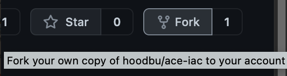

This will create a remote repository (aka repo) of the lab code in your own GitHub account.

**Remember:** your GitHub account is playing the role of Network Operator for ACE Inc.

## Code Review

Let's take a look at the files in your forked  `ace-automation` repository.

In Terraform, every file ending in `.tf` is considered. So they could all be in one big file, but the best practice is to have separate files for various purposes. Here is how each file has a purpose in this Lab:

- **main.tf** - This file contains 1 module and 1 resource. We'll be modifying this file at different points of the first two labs. The module is executing code located in the `_modules/day-zero` subfolder. The majority of the infrastructure being deployed is there. You'll see references to other, external `Aviatrix` and AWS `modules` that are available for anyone to use. These will create the networks, security groups, ec2 instances and Aviatrix gateways used in the lab. The power of modules is that you can write code once (or use other's code) and reuse it any number of times to achieve consistent implementations of the configured infrastructure. For the purpose of these labs, we'll keep it simple by modifying the files noted here. But, if you have interest in digging deeper, look into these child modules, particularly [mc-transit](https://registry.terraform.io/modules/terraform-aviatrix-modules/mc-transit/aviatrix/latest) and [mc-spoke](https://registry.terraform.io/modules/terraform-aviatrix-modules/mc-spoke/aviatrix/latest). These are the multicloud Aviatrix modules that deploy Aviatrix gateways and networks consistently across clouds.
- **providers.tf** - This file contains specific information about the `Aviatrix` and `AWS` Terraform providers that we are using in this training. The AWS provider is for creating the `BU1` and `BU2` bastion and app instances. All other resources, including vpc(s), will leverage the `Aviatrix` provider.
- **variables.tf** - Any variable with optional default values are provided here. For example, if you wanted to deploy the AWS infrastructure in a different default region than us-west-2 (Oregon), you would modify it here. You'll note there are a couple variables with no default value. We will configured `Terraform Cloud` to provide those values.
- **versions.tf** - This file has the configuration for the Terraform providers being used as well as the backend configuration (where the execution runtime and terraform state should be stored). In this case we're using the terraform cloud backend for the organization you've created to both execute Terraform and store its state config.

## Personalize the code for your accounts

Now, let's edit `versions.tf`

Be sure you're on the `ace-automation` repo in your GitHub account.


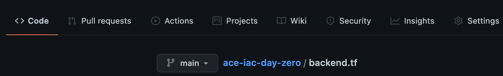

Click the Pencil icon to edit directly on GitHub.com cloud UI

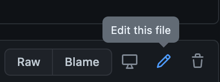

Uncomment this line:

```hcl
# organization = "<replace-with-your-Terraform-Cloud-organization-and-uncomment>"
```

Edit it with the username of your Terraform Cloud organization account. Find it here on the Terraform Cloud UI page:


Back in GitHub page, at the bottom, click Commit changes directly to the main branch.

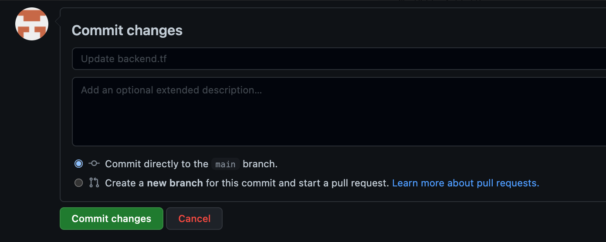

## Terraform Cloud

### Set up workspace

Create a new Workspace.


Select Version control workflow.

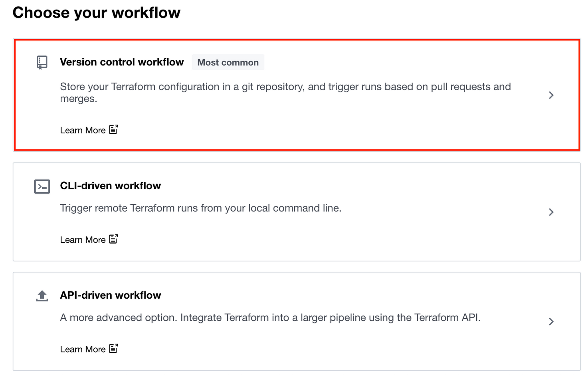

Under Connect to a version control provider, select GitHub.com

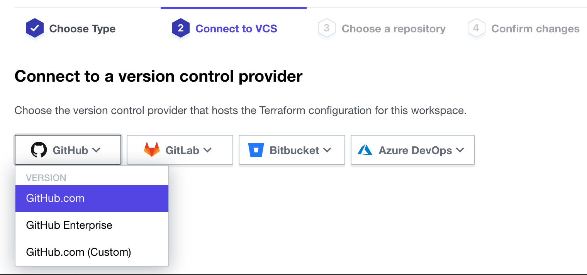

Authorize Terraform Cloud to verify your GitHub identity. If you do not see this message, disable your browser Ad Blocker as it is a pop-up dialog.

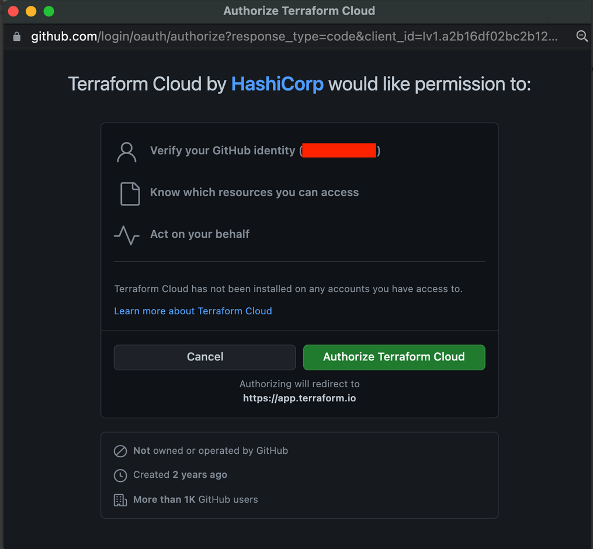

Install Terraform Cloud on your GitHub account. Keep the default of All repositories

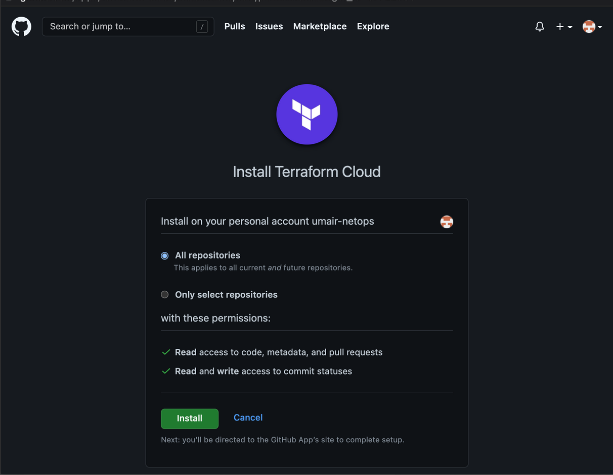

Choose the ace-iac-day-zero repository

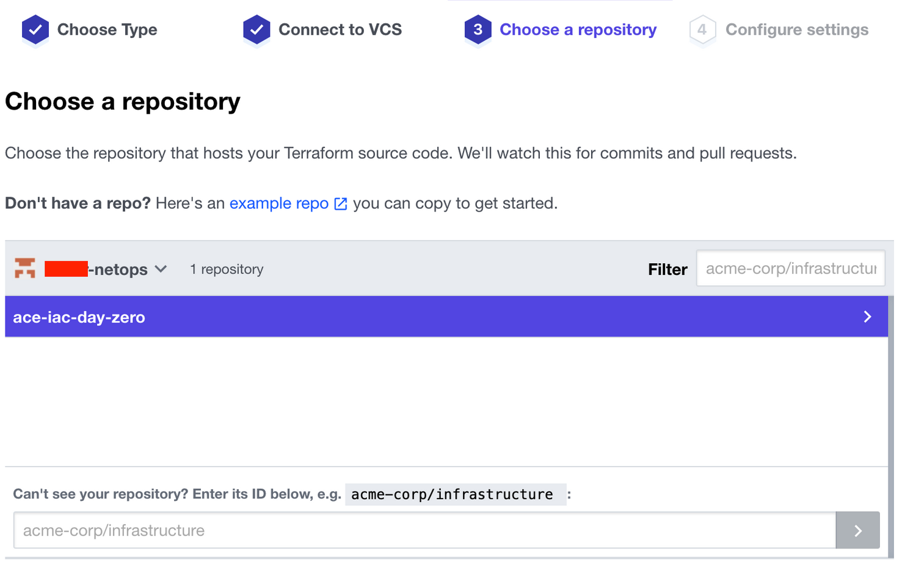

Keep the Workspace Name as is and click Create Workspace

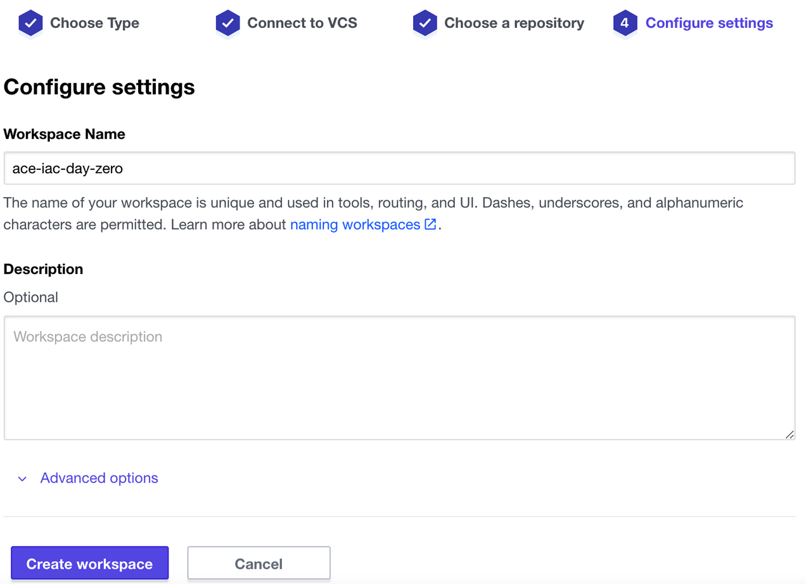

## Configure Variables

Here you will configure Terraform Variables and Environment Variables.  

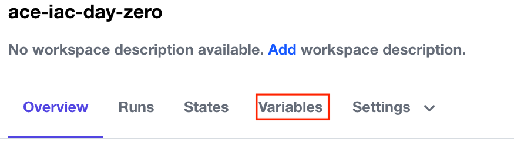

Locate the + Add variable button.


Then create/configure these five (5) Terraform Variables as follows with sensitive values for the passwords:

controller_ip = <Public IP address of your Controller>
username = admin
password = <admin password you assigned to your Controller>
aws_account_name = aws-account if your Controller is deployed via Sandbox Starter Tool; OR if you already have a Controller some other way, it is the name your AWS account appears onboarded to the Controller

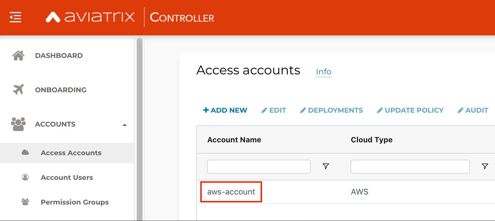

- password. Whatever you set it to, please note it down. You will use this to SSH to the workloads.

Then add these six (6) Environment Variables for the AWS and Azure CSP Security Credentials with sensitive values for all of them:

- AWS_ACCESS_KEY_ID = AWS Access Key ID that you used to deploy SST
- AWS_SECRET_ACCESS_KEY = AWS Secret Access Key that you used to deploy SST
- TF_VAR_azure_subscription_id = Azure Subscription ID. Learn how to determine it here.
- TF_VAR_azure_tenant_id = Tenant ID. This is also known as Directory ID. Learn how to determine it here.
- TF_VAR_azure_client_id = Application ID. This is also known as Client ID. Learn how to generate it here. 
- TF_VAR_azure_client_secret = Application Key. This is also known as Client Secret. Learn how to generate it here.

When you are done, it should look somewhat like this:

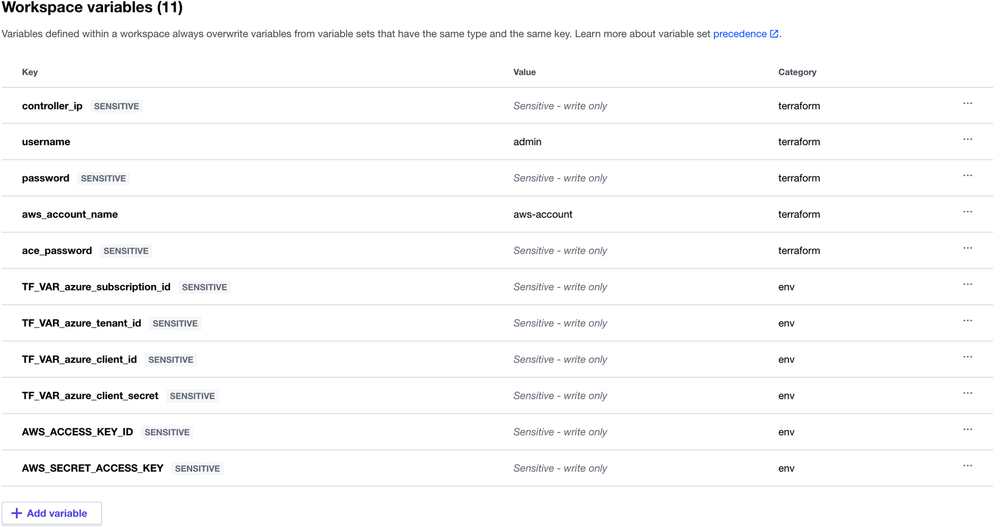

## Terraform plan and terraform apply

Move to the Overview tab and perform a terraform plan by from the Actions menu on the right side..

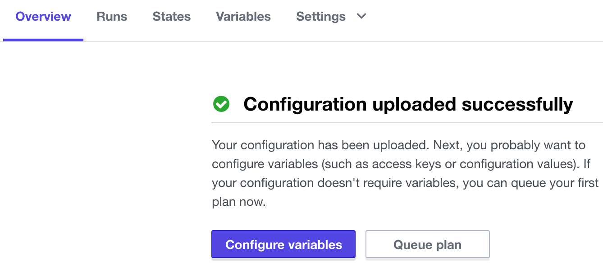

On the next page, you will see the output of the terraform plan and what resources will be built (number of resources may vary from screenshot).

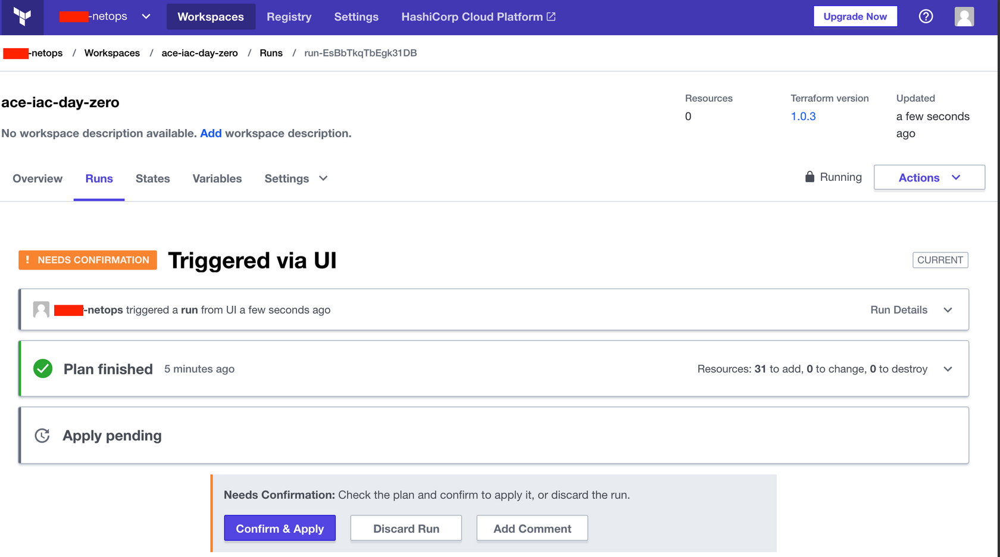

Click Confirm & Apply and provide any notes. This will issue the equivalent of terraform apply. Observe the progress of the resources being created by Terraform.

The infrastructure in Lab 1 should take about 10 minutes to build. As of version 6.5 of the Controller, gateway concurrency is supported, which means multiple gateways can be created simultaneously. When it has been built, you will see green output like this:

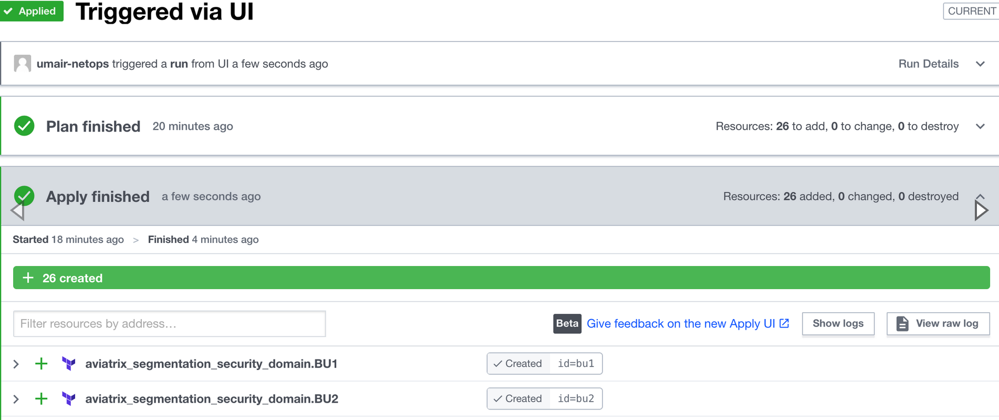

At the bottom, you will see output generated from the code at the bottom of the aws.tf and azure.tf files that will look like this:

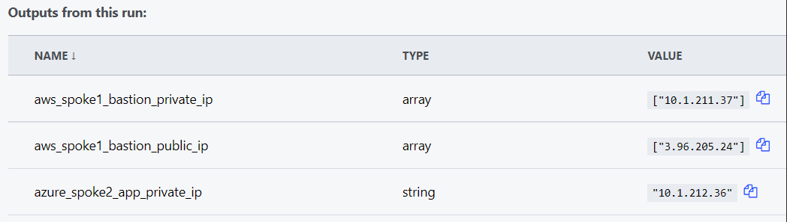

These are the Public and Private IPs of the Bastion host in BU1 (aka Spoke 1) as well as the Private IP of the App host in BU2 (aka Spoke 2).

At this point, you should be able to SSH to the BU1 Bastion as ubuntu and whatever password you set the password variable to above, but from there you won't be able to SSH to the BU2 App. The reason for that is BU1 and BU2 are not yet connected. Verify from the Controller:

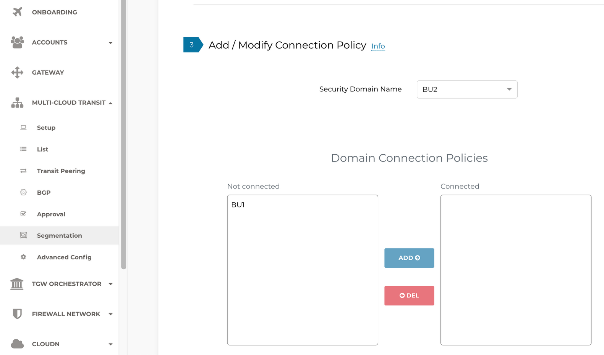

In Lab 2, you will configure a network domain Connection Policy via Terraform.
