# Overview

In this lab you will enhance your cloud infrastructure built in Lab 1 using the Aviatrix Multicloud Networking and Security platform. You will be conducting all changes on the Main branch of your existing repository from Lab 1. We are using the term Day 1 for the work done in this lab.

This lab is intended to familiarize you with Terraform code modifications.

Here is an overview of the tasks:

- Code modification
- View changes in the Controller UI

## Code Modification

It is recommended to use a localized setup with an IDE that integrates with your GitHub account. However, you can also make the code changes directly on the GitHub.com UI.

## Resize gateways

ACE Inc is growing now and needs to resize their gateways. The AWS Transit and Spoke Gateways are currently t2.micro. Verify this on the Controller > GATEWAY

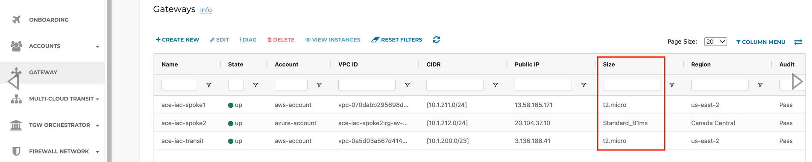

ACE needs to resize their AWS gateways from t2.micro to t3.micro.

Make this change by editing variables.tf file

On GitHub.com cloud UI, click the Pencil icon to edit directly.

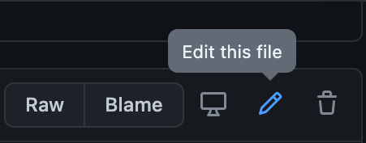

Make the change for the Transit Gateway on line 19.

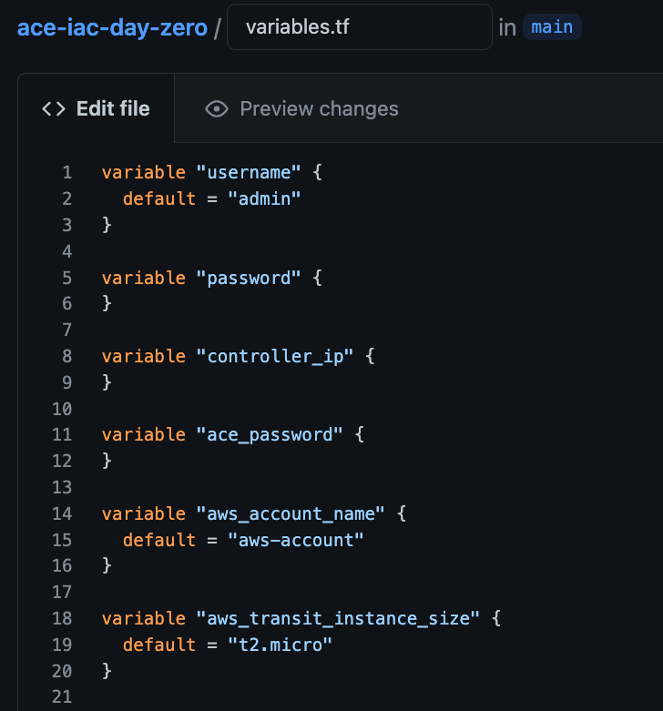

Likewise, make the change on line 35 for the Spoke Gateway size.

Provide a meaningful commit message at the bottom and click the Commit changes button.


As soon as you commit the changes to a file, it will automatically queue a Terraform Plan. Back in Terraform Cloud, navigate to the Overview tab of your workspace. Depending on how soon you navigate there, you will see blue Planning or yellow Planned in the Latest Run pane. From there, click on See details to see the planned run with proposed changes such as this:

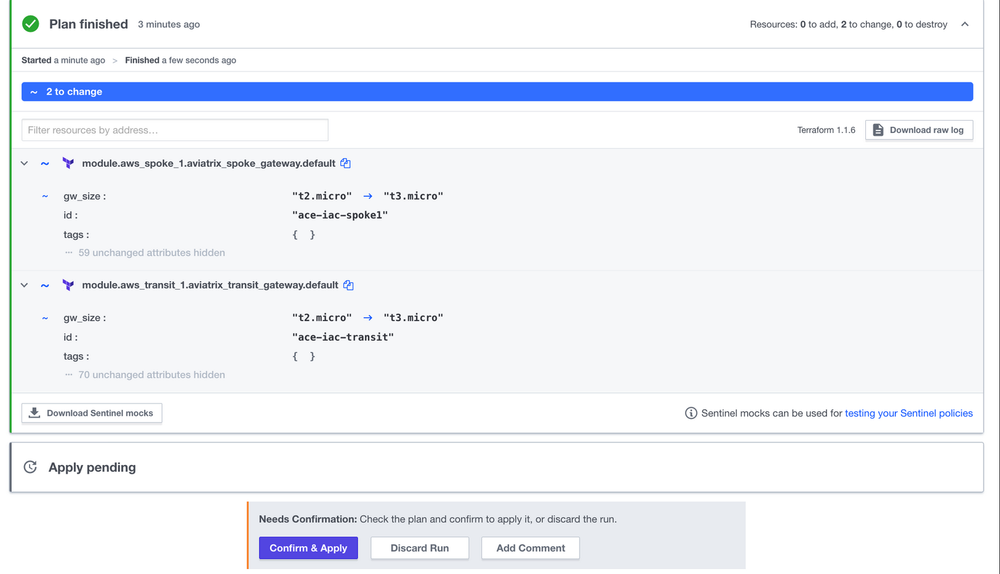

Click Confirm & Apply to see the progress of the terraform apply. When it is complete (less than 5 minutes later), both gateways in AWS will be t3.micro size.

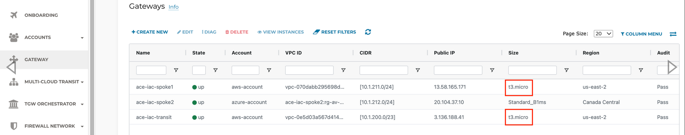

However, BU1 and BU2 are still not connected. SSH to BU1 Bastion and leave a continuous ping session running in a terminal window destined to BU2 App.

## Configure a Connection Policy

Connect BU1 to BU2 by uncommenting this block of code at the bottom of main.tf

```hcl
/* resource "aviatrix_segmentation_network_domain_connection_policy" "BU1_BU2" {
  domain_name_1 = "BU1"
  domain_name_2 = "BU2"
  depends_on    = [aviatrix_segmentation_network_domain.BU1, aviatrix_segmentation_network_domain.BU2]
} */
```

On GitHub.com cloud UI, click the Pencil icon to edit directly.

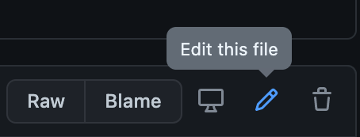

Remove the /* on line 82 and the */ on line 86.

Provide an appropriate description for the change:

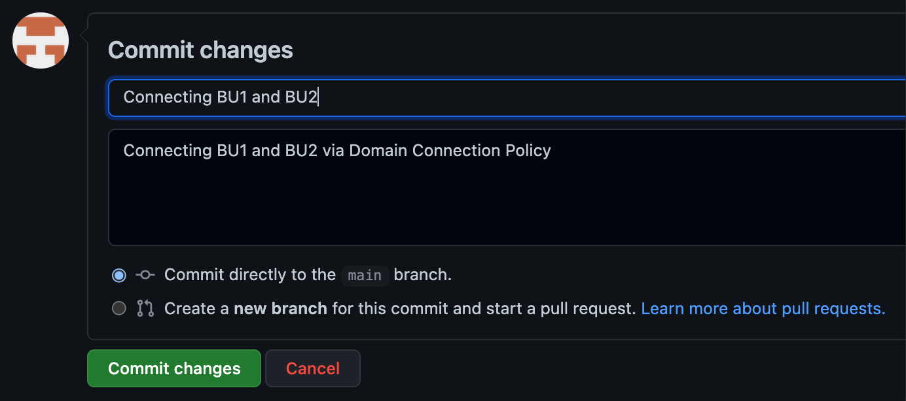

Once again, in Terraform Cloud, this will automatically trigger a Plan:

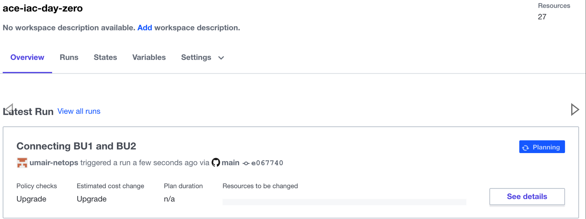

Once the plan is finished, be sure to Confirm & Apply

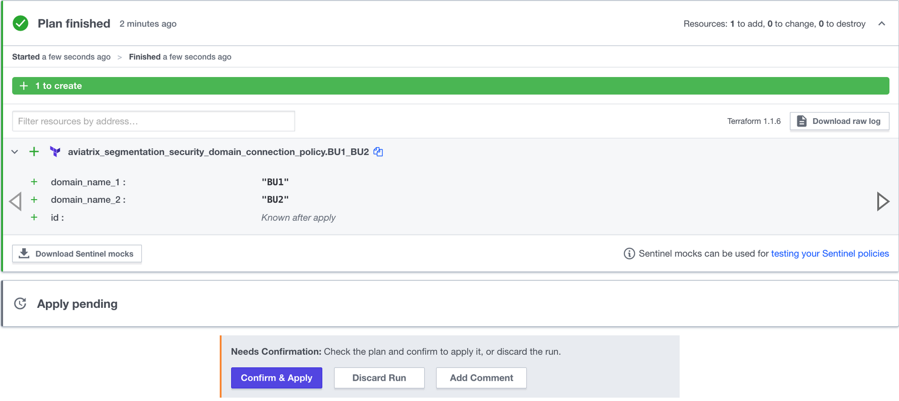

As soon as the apply is complete (should take less than a minute), notice the configured Connection Policy in the UI.

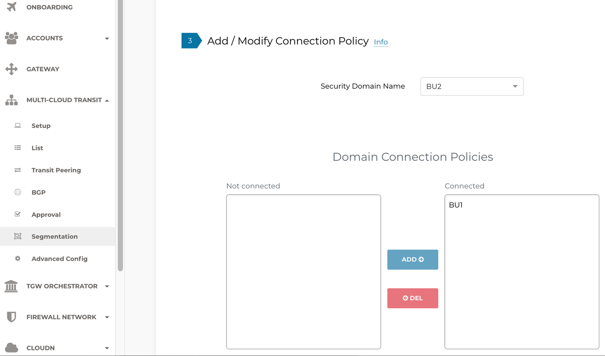

Revisit the terminal window where BU1 Bastion was attempting to Ping BU2 App. You should now see the responses.

Also, you should now be able to SSH to BU2 App from BU1 Bastion.

ACE Inc would like to have filters on what sites its apps can access. The list of those sites is not determined by the Network Operators team, but rather its Application Developers. In Lab 3, we will introduce collaboration with those teams.

## Code Optimization

Take a look at the following block of Terraform code that you just enabled on main.tf:

```hcl
  resource "aviatrix_segmentation_network_domain_connection_policy" "BU1_BU2" {
    domain_name_1 = "BU1"
    domain_name_2 = "BU2"
    depends_on    = [aviatrix_segmentation_network_domain.BU1, aviatrix_segmentation_network_domain.BU2]
  }
```

This block can be further optimized. The line beginning with depends_on is an explicit dependency on network domains that were created elsewhere in the code. Instead of hard-coding domain_name_1 and domain_name_2 as "BU1" and BU2" respectively, create implicit dependencies. Modify the code as follows:

```hcl
resource "aviatrix_segmentation_network_domain_connection_policy" "BU1_BU2" {
domain_name_1 = aviatrix_segmentation_network_domain.BU1.domain_name
domain_name_2 = aviatrix_segmentation_network_domain.BU2.domain_name
}
```

When you commit and make the change, you'll notice that it makes no changes to your infrastructure. However, it is better Terraform code because it relies less on hard-coding.

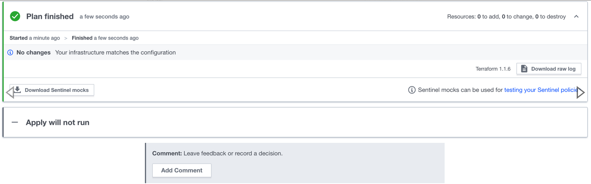

## Observations

As you can see, Terraform is extremely powerful and scalable. With just a few lines of code, you can make a lot of changes. Notice how easy it was to make a change to your infrastructure. It also means that if you make a mistake, you could easily bring down your infrastructure. To mitigate risk, your organization will benefit from having some guard rails, especially in a Production environment. In Lab 3, we will do exactly that.
