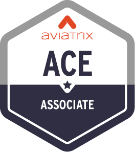
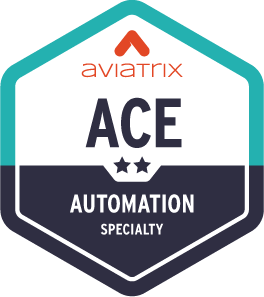
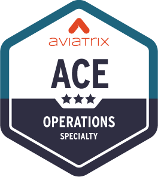
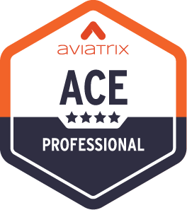

# Summary  

**Congratulations!!!**  

You have just built, enhanced, and secured a multi-cloud network by using automation. By using git branches and enabling collaboration with DevOps and SecOps teams to build CI/CD pipelines with secured branches, you have experienced true NetOps in action. Many of Aviatrix's largest customers practice IaC day in and day out. While the choice of tools (e.g. Jenkins instead of Terraform Cloud, GitLab instead of GitHub) may vary across enterprises, the concepts of Infrastructure as Code remain the same.

Be sure to clean up your resources to avoid any excess charges.

---
The ACE Program is the industry’s first and only multicloud networking certification. Its comprehensive trainings and specialized courses provide a deep understanding of how to build, operate, automate, scale, and secure cloud networks across AWS, Azure, GCP, and OCI. The ACE Program equips participants with best practices that span all major cloud providers, regardless of whether they use Aviatrix secure cloud networking.

